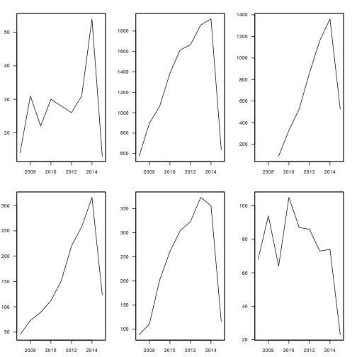

## R statistical programming language:
R <http://www.r-project.org/> is well worth learning if you are interested in Big Data and new communication through data

- free, and available for all platforms
- versatility - swiss army knife
- decent documentation; great support

---

## Some packages I have used, for:

- Big Data analysis - scholar
- software integration - RNetLogo
- combining visual and statistical analysis - igraph
- visualising multidimensional data - ggplot2
- interactive web applications - shiny
- other dynamic web outputs
    + presentations - slidify
    + reports - knitr

---

## examples
- Shiny see <https://richarit.shinyapps.io/shiny-simex/>
- Scholar
 
